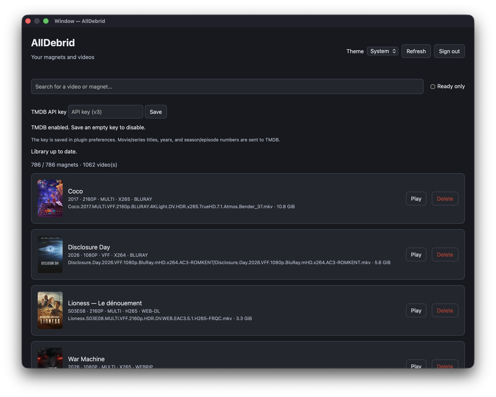

# AllDebrid for IINA

Browse your AllDebrid videos and play them in IINA. Includes search, a ready-only filter, file details, and optional TMDB titles and posters.



## Installation

Requires **IINA 1.4.0+** on macOS with plugins enabled, **Node.js 24+**, and **Python 3**.

```sh
npm ci
npm run pack
```

1. Open `dist/alldebrid.iinaplgz` to install the plugin.
2. Open **Plugins → AllDebrid → AllDebrid Library…**.
3. Click **Sign in to AllDebrid** and confirm the displayed PIN in your browser.
4. Click **Play** on a ready video to open it in a new IINA window.

Your AllDebrid account must allow access to magnets and link unlocking. Playback depends on file availability and IINA's supported formats.

## Usage

- **Refresh** updates your library. Videos in nested folders are included; archives and ISO images are not scanned.
- **Search** matches magnet names, video paths, and metadata, ignoring case and accents.
- **Ready only** hides videos that cannot yet be played.
- **Theme** offers System, Light, and Dark and remembers your choice.
- **Delete** hides a video locally, including after refresh or restart. Deleting a magnet's last remaining video **deletes the entire magnet from AllDebrid, including non-video files**. Search and filters do not affect this count. If deletion fails, the last video remains available for retry.

The plugin does not add or restart magnets.

### Optional TMDB metadata

Enter a TMDB **API key (v3)** and click **Save** to enable titles, episode names, and posters. Get a key from your [TMDB account settings](https://www.themoviedb.org/settings/api). Save an empty key to disable it.

Matches use information parsed from filenames and may be imperfect. Titles are requested in French. TMDB failures do not block playback.

## Data and privacy

- AllDebrid and TMDB API keys are stored in **plugin preferences, not a secure keychain**.
- **Sign out** clears the saved AllDebrid key, displayed library, and pending operations. It keeps your TMDB key, theme, and hidden videos. To revoke the AllDebrid key, use [AllDebrid API key settings](https://alldebrid.com/apikeys/).
- No telemetry. When enabled, TMDB receives titles, years, and season/episode numbers; posters load from its image host.
- File listings and AllDebrid file links stay in memory for the session. IINA streams from the direct link's host and may retain playback URLs in its history.

## Development

TypeScript sources live in `src/`; build output goes to `dist/plugin`.

```sh
npm run lint       # Check code and formatting
npm run typecheck  # Validate TypeScript
npm test           # Build and run unit and regression tests
npm run pack       # Build and create the plugin archive
```

On macOS, link the built plugin for development and rebuild after changes:

```sh
/Applications/IINA.app/Contents/MacOS/iina-plugin link dist/plugin
```

Authentication and playback require manual testing on macOS with an AllDebrid account.

API docs: [IINA](https://docs.iina.io/) · [AllDebrid](https://docs.alldebrid.com/)
